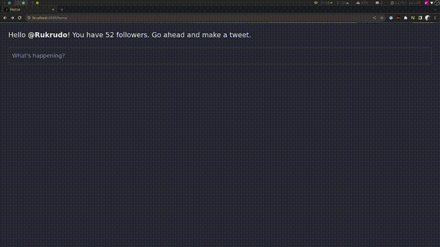

# A Twitter Client built with NextJS

I don't plan on updating this. I wanted to build it as my first NextJS project, and it went well. I'm leaving it as is because I can't implement proper oAuth authentication without an entire rewrite – which wouldn't be worth my time.

